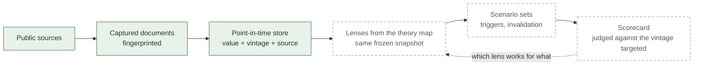

# Atlas Research

**Turning discretionary analysis into data.**

*Competing theories. The same data. A dated verdict.*

> **Status, 2026-09-24.** The data chain works end to end on a small corpus. The theory map and the
> rules for a valid scenario are written. No economic analysis is produced yet, and there is no track
> record. Details in [Where it stands](#where-it-stands).

---

## Why this exists

Economic commentary is everywhere, and very little of it is ever checked.

- **It is rarely accountable.** A view is seldom dated in a form anyone can check, seldom says what
  would prove it wrong, and is quietly rewritten once events move.
- **It uses one lens at a time.** The same numbers can support a monetary, a fiscal, a supply-side or
  a credit explanation. A reader usually gets the one the writer prefers, and loses the most useful
  information: where serious explanations disagree, and why.
- **The data moves underneath it.** GDP and employment figures are revised for years after they are
  first published. Judging an old call against today's numbers is unfair in both directions.

Forecasts are sometimes scored: by surveys of professional forecasters, by central banks reviewing
their own projections, and in academic horse races between models. What is rarely done is to score
*competing explanations* side by side, on the data that was available at the time, across many kinds
of situation. Atlas is being built to do that.

---

## The idea

Atlas is being built to treat economic analysis the way a statistics office treats a data release:
dated, sourced, versioned. Four steps. The first works today; the other three are specified, not yet
running.

1. **Record what was known, and when** (*point-in-time* data). Every number points to the exact source
   it was read from and the date it became known. Revisions are added, never written over.
2. **Run the relevant theories on the same data.** Each theory is a *lens*. Lenses will read the same
   frozen snapshot of the data and never see each other's conclusions, so one cannot colour another.
3. **Turn each lens into explicit scenarios.** At least two branches, each with an observable trigger,
   a horizon, and the condition that would invalidate it. "Not enough information" is an accepted
   answer.
4. **Keep score.** What counts as the outcome is fixed when the scenario is written. Once the horizon
   has passed, each branch will be marked realised, invalidated, not realised, or undecidable. Over
   time, that becomes a map of which reasoning works for what.

---

## Two disciplines, one system

### The economics

A **theory map** of 23 families and 72 named lenses, most of them competing explanations. It runs from
New Keynesian inflation to the fiscal theory of the price level, and from sudden stops to the loop
between sovereign debt and the banks that hold it. Each lens states its assumptions, the inputs it needs, a
situation where it fails, the simpler baseline it has to beat, and the outcomes that would count
against it.

Claims are typed. A claim filed as causal must name its mechanism, its rivals, how the effect was
identified, and what would refute it. A scenario has to be falsifiable before it is allowed to exist.
→ [`docs/ECONOMICS.md`](docs/ECONOMICS.md)

### The data

Public sources only. Every value keeps a pointer to the exact bytes of the document it was read from;
if the document changes, the pointer breaks and the system refuses. Every observation carries its
*vintage*, the version published on a given date. A missing value is never silently turned into a
zero. Check the provenance claim yourself in one command: [`examples/`](examples/).
→ [`docs/ARCHITECTURE.md`](docs/ARCHITECTURE.md)

### Why they need each other

- **Economics needs dated data to be judged.** Without a record of what was knowable on the day, a
  theory that was right cannot be told apart from one fitted afterwards.
- **Dated data is worth keeping because it judges reasoning.** Real-time archives such as ALFRED
  already keep vintages for major US series. Atlas extends that discipline to every value it uses and
  ties each one to the document it came from; what makes that worth the effort is using it to judge
  reasoning.
- **Scorekeeping is slow.** The United States has had about a dozen recessions since the Second World
  War, so rare events give few test cases. Judging a way of reasoning needs many dated calls across
  countries, sectors and horizons. That is why the recording starts before the first product.

> You cannot learn which theory works if you let history be rewritten.

---

## How it fits together

Green boxes work today, on a seven-record corpus. Dashed boxes are not running yet: the scenario rules
are coded and tested on test cases only, lenses are not yet applied to any data, and the scorecard has
not started.

---

## What Atlas will serve

Atlas is an engine rather than a single product. Built on it: research for people who need to
understand the economy, and datasets for quantitative research. Coverage starts with the United
States, then Switzerland and Europe.

The exact shape of the first product is deliberately left open; it will be shaped with the people who
ask for it. Nothing here is investment advice.

---

## Where it stands

| Component | State |
|---|---|
| Data chain: capture, anchoring, point-in-time storage, re-read, rendering | Works end to end |
| Data volume | 7 records. The chain is proven; the corpus is not built |
| Theory map: 23 families, 72 lenses | Written; every lens states what would count against it |
| Scenario rules | Coded and tested on test cases; not yet fed by real data |
| Lenses applied to stored data | Not yet: the report generator consults neither the classification layer nor the theory map |
| Scorecard | Not started |
| Independent review of the map's economic content | Not yet done |
| Product (interface, users, subscription) | None |

The build plan holds **170 steps across 14 arcs, 60 of them done**, and **45 blocking defects are open
and tracked** (snapshot 2026-09-16: [progress](docs/PROGRESS.md), [roadmap](docs/ROADMAP.md)).
Theory-map counts were taken on 2026-09-24.

---

## How it is built

Several LLM agents work in parallel under rules enforced by code. No agent reviews its own work: a
separate agent does, and a human arbitrates when they disagree. The build can refuse its own builders,
for instance when tooling commits pile up while the product has not advanced. Language models are used
as a governed tool, never as a source of facts: code extracts candidate values, and the model picks
one or abstains.
→ [`docs/ENGINEERING.md`](docs/ENGINEERING.md)

---

## What is in this repository

This is the public window on the project. The implementation is in a private repository.

| Path | What it holds |
|---|---|
| [`docs/ECONOMICS.md`](docs/ECONOMICS.md) | The economic method: the theory map, how lenses are kept apart, what makes a scenario valid, how scoring will work. |
| [`docs/ARCHITECTURE.md`](docs/ARCHITECTURE.md) | The data chain layer by layer, and what each layer refuses. |
| [`docs/ENGINEERING.md`](docs/ENGINEERING.md) | How the work is split between LLM agents, and the rules that keep them honest. |
| [`docs/PROGRESS.md`](docs/PROGRESS.md) | Measured state, quoted from the project's own counters. |
| [`docs/ROADMAP.md`](docs/ROADMAP.md) | The 14 arcs, and what is deliberately deferred. |
| [`examples/`](examples/) | A real captured document and a script that re-reads its byte ranges: the provenance claim, checkable in one command. |

---

## Limits

- The corpus is tiny. Seven records prove the chain; they are not a dataset.
- The engine produces no economic analysis yet. The theory map and the report generator are not
  connected.
- The theory map is uneven. Several central families (monetary policy, exchange rates, growth) hold
  two lenses each today, and 20 of the 72 lenses still declare a gap where a reference work should be.
  [`ECONOMICS.md`](docs/ECONOMICS.md) gives the count for every family.
- The map's economic content has not been reviewed by an independent economist. Each lens has every
  field filled in (references or a declared gap); none has been reviewed for being the best statement
  of its theory.
- There is no track record. The scorecard begins with the first dated scenarios.
- Apart from the provenance check in [`examples/`](examples/), the claims here describe a private
  repository and cannot be verified from this one.

---

Built by Sami Andaloussi. Corrections are welcome, especially "your number is wrong" and "your theory
map is missing something".
